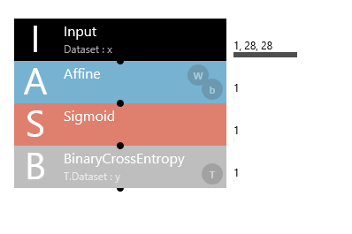

Layer 
=====================================
## Goals
  - Understanding basics of the layer and how it works by lookig at layer in 01_logistic_regression.sdcproj which is the simplest one as a example.  

## What is Layer ?

> layers and their properties that can be used with the Neural Network Libraries.  

> Reference [Layer reference](https://support.dl.sony.com/391/)

Look at the layer below.

- **input** 
  - Dataset
    - Specifies the name of the variable to input into this Input layer.
  - size
    - Specifies the input size.
For image data, the size is specified in the “the number of colors,height,width” format.
      - For example, for a RGB color image whose width is 32 and height is 24, specify “3,24,32”. For a monochrome image whose width is 64 and height is 48, specify “1,48,64”.  
  
- **Affine**
  - The affine layer is a fully-connected layer that has connections from all inputs to all output neurons specified with the OutShape property.  
o = Wi+b  
(where **i** is the input, o is the output, **W** is the weight, and **b** is the bias term.)  
[affine transformation](https://en.wikipedia.org/wiki/Affine_transformation#Representation)

- **Weight**
  - There is **connctions** or **edges** between Nodes from adjacent layers, all these connections have **weights** associated with them.

- **Bias**
  - a bias value allows you to shift the activation function to the left or right  
  - The main funtion of Bias it to provide every node with a trainable constant value(in addition to the normal inputs that the node receives). See this [link](https://stackoverflow.com/questions/2480650/role-of-bias-in-neural-networks) to learn more about the role of bias in a neuron.  
Reference [A Quick Introduction to Neural Networks](https://ujjwalkarn.me/2016/08/09/quick-intro-neural-networks/)
  
  
